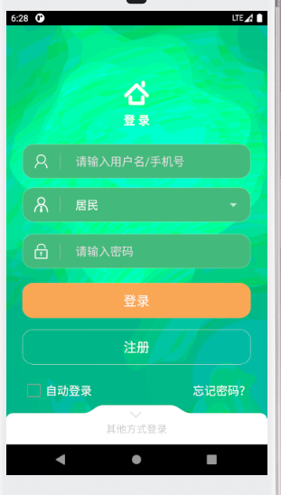
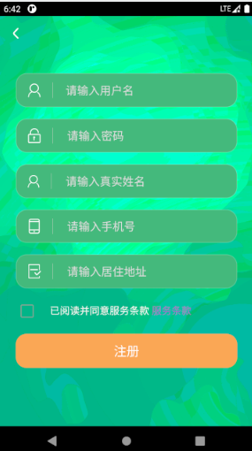
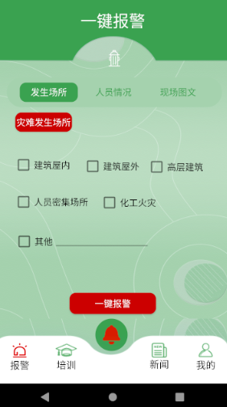
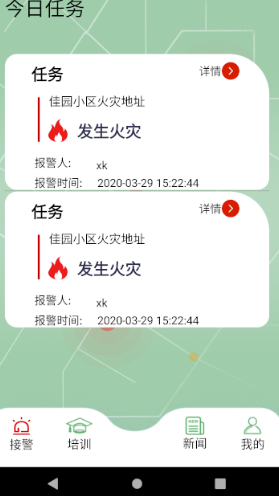
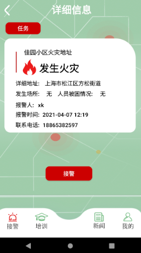

# 智慧消防app

1. 项目描述:
   当小区发生火灾时，用户跳转到报警页面，点击报警按钮，会向订阅该小区的小区消防站发送消息，而订阅该小区消防站的消防员会收到该消息并订阅该消息发布用户的手机号，消防员接警成功后会向该用户发送接警成功消息。
2. 功能描述
   - 用户登录和注册功能
   - 用户报警功能
   - 消防员接警功能
3. 应用截图

      
      
      
       
      
      
      

